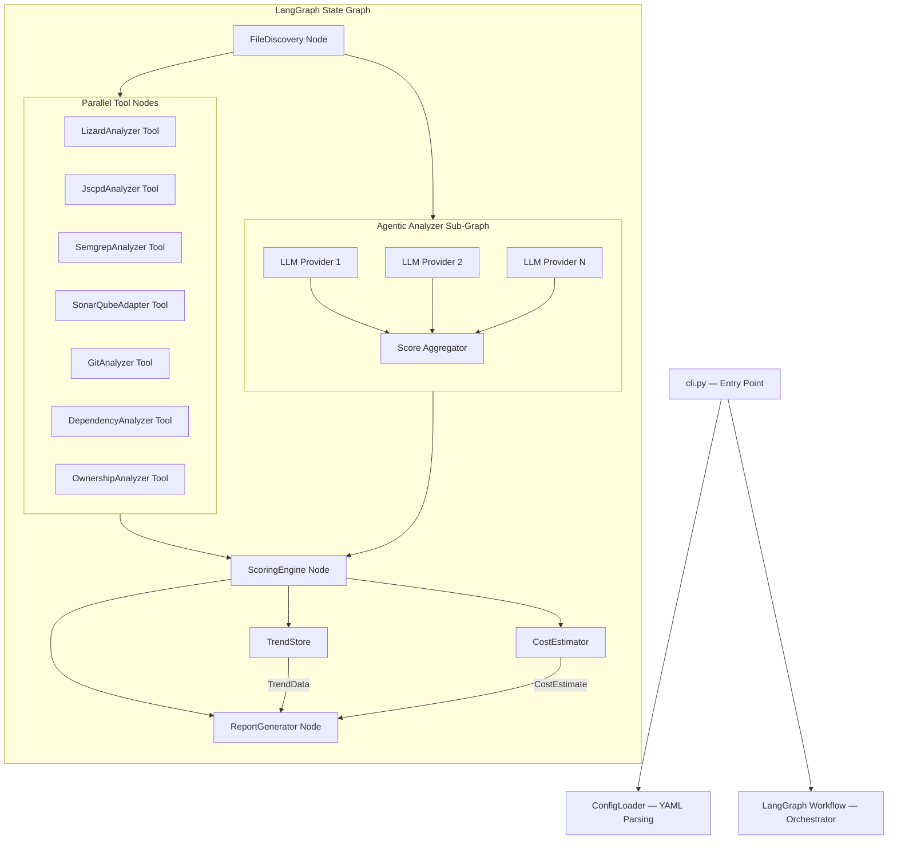
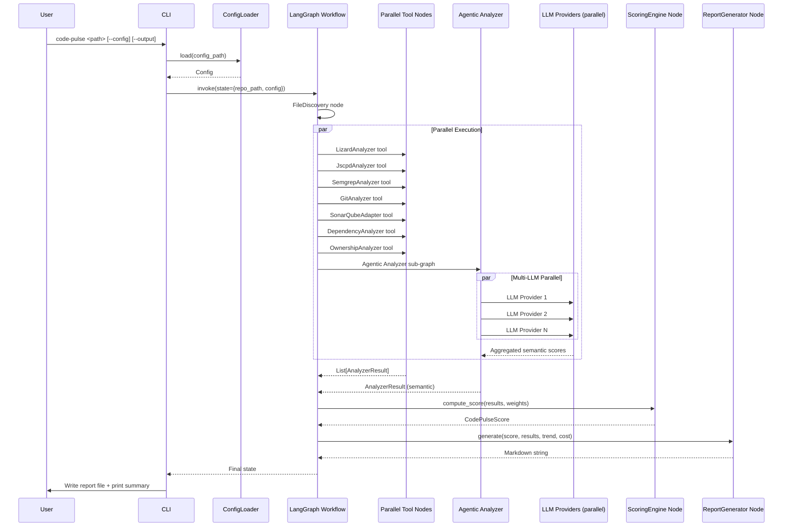
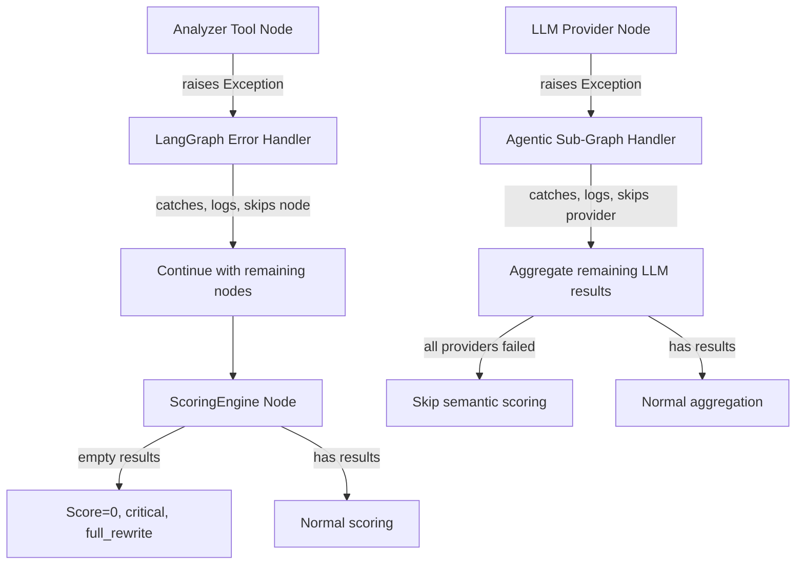

# Design Document — CodePulse Analyzer

## Overview

CodePulse is a Python 3.10+ CLI tool that evaluates codebase maintainability by orchestrating multiple pluggable analyzers via a LangGraph agent workflow, combining their results via a weighted ensemble scoring engine, and producing a structured Markdown report with Mermaid diagrams.

The system uses LangGraph as its orchestration backbone. Each analyzer (lizard, jscpd, semgrep, SonarQube, GitPython, dependency checks, ownership analysis) is a tool node in the graph. Deterministic tool nodes execute in parallel. The Agentic Analyzer (formerly LLM Analyzer) is a LangGraph sub-graph that runs multiple LLMs in parallel and aggregates their semantic scores. After all tool nodes complete, results flow sequentially through the ScoringEngine and ReportGenerator nodes.

Each analysis source implements a common `Analyzer` interface (adapter pattern). The CLI (`code-pulse`) serves as the entry point: it loads YAML configuration, builds the LangGraph state graph, and invokes it.

Key design goals:
- Pluggability: new analyzers can be added as tool nodes without modifying existing code
- Parallel execution: deterministic analyzers and multiple LLMs run concurrently via LangGraph
- Graceful degradation: if an external tool is missing or fails, the system logs a warning and continues
- Configurability: all analyzer weights, enabled/disabled status, LLM providers, and tool-specific settings are controlled via a YAML file
- Observability: optional LangSmith or Langfuse integration for tracing and debugging
- Deterministic scoring formula: `CodePulse_Score = Σ(weight_i × normalized_score_i) / Σ(weight_i)`

## Architecture



### Execution Flow



### Design Decisions

1. **LangGraph as orchestration backbone**: The entire analysis pipeline is a LangGraph state graph. This gives us parallel execution of tool nodes, state management, error handling at the graph level, and optional observability via LangSmith/Langfuse. Each analyzer is a tool node, making the pipeline declarative and extensible.

2. **Adapter pattern for analyzer tools**: Each analyzer wraps a different external tool or API. The adapter pattern keeps the interface uniform while allowing wildly different implementations (subprocess calls, REST API, Python library, LLM API). Each adapter is registered as a LangGraph tool.

3. **Parallel tool execution**: Deterministic analyzers (lizard, jscpd, semgrep, git, SonarQube, dependency, ownership) run in parallel via LangGraph's `Send` API or parallel branches. This significantly reduces total analysis time for large repos.

4. **Agentic Analyzer as a sub-graph**: The Agentic Analyzer (semantic scoring) is a LangGraph sub-graph that runs multiple LLMs in parallel. Each LLM provider is a node in the sub-graph. Results are aggregated via configurable strategy (median, average, or conservative min). This provides unbiased semantic scoring not dependent on any single model.

5. **Subprocess invocation for external tools**: jscpd (Node.js) and semgrep are invoked via `subprocess.run()` with timeout and error handling. This avoids Python binding dependencies and matches how these tools are typically used.

6. **Conservative scoring for overlapping dimensions**: When multiple analyzers score the same quality dimension (e.g., both lizard and SonarQube report complexity), the `ScoringEngine` takes the lower (more conservative) score. This prevents inflated scores from redundant positive signals.

7. **YAML configuration**: Chosen over TOML/JSON for readability and comment support. PyYAML is the parser.

8. **Markdown + Mermaid for reports**: Markdown is universally renderable (GitHub, GitLab, IDEs). Mermaid diagrams are natively supported by GitHub and many Markdown viewers.

9. **Optional observability**: LangSmith (hosted SaaS, free tier available) or Langfuse (open source, self-hostable) can be configured for tracing and debugging the LangGraph workflow. Neither is required for operation.


## Components and Interfaces

### Analyzer Interface (Abstract Base)

```python
from abc import ABC, abstractmethod
from dataclasses import dataclass
from pathlib import Path
from typing import Any, Dict, List, Optional

@dataclass
class AnalyzerResult:
    """Uniform result returned by every analyzer."""
    analyzer_name: str
    dimension: str                    # e.g. "complexity", "duplication", "semantic"
    normalized_score: float           # 0-100
    per_file_scores: Dict[str, float] # path -> 0-100 score
    details: Dict[str, Any]           # analyzer-specific metadata
    warnings: List[str]               # non-fatal issues encountered

class Analyzer(ABC):
    """Common interface all analyzer plugins must implement."""

    @abstractmethod
    def name(self) -> str:
        """Unique identifier for this analyzer."""
        ...

    @abstractmethod
    def dimension(self) -> str:
        """Quality dimension this analyzer measures."""
        ...

    @abstractmethod
    def analyze(self, repo_path: Path, settings: Dict[str, Any]) -> AnalyzerResult:
        """Run analysis and return normalized results."""
        ...
```

### AnalyzerRegistry & LangGraph Workflow Builder

```python
from langgraph.graph import StateGraph, END
from typing import TypedDict

class AnalysisState(TypedDict):
    repo_path: str
    config: Config
    discovered_files: Dict[str, List[str]]
    results: List[AnalyzerResult]
    score: Optional[CodePulseScore]
    trend: Optional[TrendData]
    cost: Optional[CostEstimate]
    ownership: Optional[OwnershipData]
    report: Optional[str]

class AnalyzerRegistry:
    """Discovers, stores, and builds LangGraph workflow from Analyzer plugins."""

    def register(self, analyzer: Analyzer) -> None: ...
    def get_enabled(self, config: Config) -> List[Analyzer]: ...
    def build_graph(self, config: Config) -> StateGraph: ...
```

- `build_graph()` constructs a LangGraph `StateGraph` with:
  - A `file_discovery` node that runs first
  - Parallel branches for all enabled deterministic analyzer tool nodes
  - A parallel branch for the Agentic Analyzer sub-graph
  - A `scoring_engine` node that runs after all analyzers complete
  - `trend_store`, `cost_estimator`, and `report_generator` nodes that run sequentially after scoring
- Each analyzer tool node wraps the `Analyzer.analyze()` call in error handling and appends results to state
- If an analyzer raises an exception, it is logged and skipped — the state continues with remaining results

### ConfigLoader

```python
@dataclass
class AnalyzerConfig:
    enabled: bool
    weight: float                     # 0.0 to 1.0
    settings: Dict[str, Any]          # tool-specific settings

@dataclass
class Config:
    analyzers: Dict[str, AnalyzerConfig]
    output_path: Optional[str]
    trend_store_path: Optional[str]
    ci_threshold: Optional[float]

class ConfigLoader:
    """Reads and validates YAML configuration files."""

    @staticmethod
    def load(path: Path) -> Config: ...

    @staticmethod
    def default() -> Config: ...
```

- Validates field types and required fields; raises `ConfigError` with the specific field name and expected type on failure.
- `default()` returns a sensible configuration with all analyzers enabled at equal weights.

### ScoringEngine

```python
@dataclass
class CodePulseScore:
    final_score: float                # 0-100
    tier: str                         # "excellent" | "good" | "poor" | "critical"
    recommendation: str               # "maintain" | "refactor" | "partial_rewrite" | "full_rewrite"
    per_file_scores: Dict[str, float]
    dimension_scores: Dict[str, float]

class ScoringEngine:
    """Computes the weighted ensemble CodePulse Score."""

    @staticmethod
    def compute(results: List[AnalyzerResult], config: Config) -> CodePulseScore: ...
```

- Normalizes all scores to 0-100 (analyzers already return normalized scores, but the engine validates the range).
- For overlapping dimensions: groups results by `dimension`, takes `min()` of normalized scores within each group.
- Applies the weighted formula: `Σ(weight_i × score_i) / Σ(weight_i)`.
- If no results exist, returns score=0, tier="critical", recommendation="full_rewrite".

### ReportGenerator

```python
class ReportGenerator:
    """Produces Markdown reports with Mermaid diagrams."""

    @staticmethod
    def generate(
        score: CodePulseScore,
        results: List[AnalyzerResult],
        trend: Optional[TrendData],
        cost: Optional[CostEstimate],
        ownership: Optional[OwnershipData],
    ) -> str: ...
```

- Outputs a Markdown string with sections: Summary, Per-File Table, Dimension Breakdown (Mermaid bar chart), Score Distribution (Mermaid pie chart), Trend Analysis, Cost-to-Fix, Team Insights.
- Mermaid blocks are fenced with ` ```mermaid ` for native rendering on GitHub/GitLab.

### Concrete Analyzers

| Analyzer | Wraps | Invocation | Dimension |
|---|---|---|---|
| `LizardAnalyzer` | lizard (Python lib) | `lizard.analyze_files()` | complexity |
| `JscpdAnalyzer` | jscpd (Node CLI) | `subprocess.run(["jscpd", ...])` | duplication |
| `SemgrepAnalyzer` | semgrep (CLI) | `subprocess.run(["semgrep", ...])` | anti_patterns |
| `SonarQubeAdapter` | SonarQube REST API | `requests.get(...)` | sonarqube |
| `GitAnalyzer` | GitPython | `git.Repo(path)` | git_risk |
| `AgenticAnalyzer` | Multi-LLM (LangGraph sub-graph) | Parallel LLM API calls | semantic |
| `DependencyAnalyzer` | pip/npm metadata | subprocess + API calls | dependency_health |
| `OwnershipAnalyzer` | GitPython (blame) | `git.Repo(path).blame()` | ownership |

### Agentic Analyzer (LangGraph Sub-Graph)

```python
from langgraph.graph import StateGraph
from typing import TypedDict, List

class AgenticState(TypedDict):
    files: List[str]
    llm_configs: List[Dict[str, Any]]
    coding_standards: List[str]       # loaded standards documents
    llm_results: List[Dict[str, Any]]
    aggregated_result: Optional[AnalyzerResult]

class AgenticAnalyzer(Analyzer):
    """Multi-LLM semantic analyzer implemented as a LangGraph sub-graph."""

    def name(self) -> str:
        return "agentic"

    def dimension(self) -> str:
        return "semantic"

    def analyze(self, repo_path: Path, settings: Dict[str, Any]) -> AnalyzerResult:
        """Loads coding standards, builds and invokes the multi-LLM sub-graph."""
        ...

    def _build_subgraph(self, llm_configs: List[Dict]) -> StateGraph:
        """Creates a LangGraph sub-graph with parallel LLM nodes."""
        ...

    def _create_llm_node(self, provider: str, model: str, api_key: str):
        """Creates a node function for a single LLM provider.
        The node receives coding standards context and file content,
        then returns semantic scores and standards violations."""
        ...

    def _aggregate_scores(
        self, llm_results: List[Dict], strategy: str
    ) -> AnalyzerResult:
        """Aggregates multi-LLM scores using configured strategy.
        
        Strategies:
        - 'median': Use median score across LLMs (default)
        - 'average': Use arithmetic mean
        - 'conservative': Use minimum score (most pessimistic)
        """
        ...
```

- Each configured LLM provider becomes a parallel node in the sub-graph
- All LLM nodes execute concurrently via LangGraph's parallel branching
- The aggregator node collects all LLM results and combines them using the configured strategy
- If an LLM node fails (timeout, rate limit, error), it is skipped and aggregation proceeds with remaining results
- When only one LLM is configured, the sub-graph simplifies to a single node with no aggregation
- Coding standards documents are loaded before the sub-graph executes and passed as context to each LLM node
- Standards are filtered by language relevance per file to stay within token budgets

### CodingStandardsLoader

```python
from dataclasses import dataclass
from pathlib import Path
from typing import List, Optional

@dataclass
class CodingStandard:
    name: str
    content: str
    languages: List[str]              # applicable languages, empty = all
    source: str                       # "system" | "predefined" | "custom"

class CodingStandardsLoader:
    """Discovers and loads coding standards from configured sources."""

    PREDEFINED_STANDARDS = {
        "solid-principles",
        "clean-code",
        "owasp-secure-coding",
        "google-style-python",
        "google-style-java",
        "airbnb-style-javascript",
    }

    def load(self, settings: Dict[str, Any]) -> List[CodingStandard]:
        """Loads standards based on mode: system, predefined, custom, or combined."""
        ...

    def _load_system_standards(self) -> List[CodingStandard]:
        """Loads built-in CodePulse default standards."""
        ...

    def _load_predefined_standards(self, names: List[str]) -> List[CodingStandard]:
        """Loads named industry standard rulesets from bundled resources."""
        ...

    def _load_custom_standards(self, path: Path) -> List[CodingStandard]:
        """Loads .md and .txt files from a custom directory."""
        ...

    def filter_by_language(
        self, standards: List[CodingStandard], language: str
    ) -> List[CodingStandard]:
        """Returns only standards applicable to the given language."""
        ...
```

- System standards are bundled with CodePulse under `src/code_pulse/standards/`
- Predefined standards are named rulesets (e.g., "solid-principles") also bundled
- Custom standards are loaded from a user-specified directory (Markdown and text files)
- Language filtering ensures only relevant standards are sent to the LLM, keeping token usage efficient
- If custom_path doesn't exist or is empty, a warning is logged and only system/predefined standards are used

### TrendStore

```python
@dataclass
class TrendEntry:
    timestamp: str                    # ISO 8601
    score: float
    tier: str

@dataclass
class TrendData:
    entries: List[TrendEntry]
    direction: str                    # "improving" | "stable" | "degrading"

class TrendStore:
    """Persists and retrieves historical CodePulse scores."""

    def save(self, entry: TrendEntry) -> None: ...
    def load(self) -> TrendData: ...
```

- Stores entries as JSON lines in a local file (default: `.codepulse-trend.jsonl`).
- `direction` is computed by comparing the latest score to the previous one.

### CostEstimator

```python
@dataclass
class CostEstimate:
    current_tier: str
    target_tier: str
    estimated_person_days: float
    breakdown: Dict[str, float]       # per-file or per-category estimates

class CostEstimator:
    """Estimates effort to improve from current tier to next tier."""

    @staticmethod
    def estimate(score: CodePulseScore, results: List[AnalyzerResult]) -> CostEstimate: ...
```

- Uses file count, individual scores, and issue severity to produce a rough person-day estimate.
- Targets the next higher tier (e.g., poor → good).

### FileDiscovery

```python
class FileDiscovery:
    """Discovers source files in the repository."""

    SUPPORTED_EXTENSIONS = {".py", ".java", ".js", ".ts"}
    EXCLUDED_DIRS = {"node_modules", ".git", "__pycache__", "build", "dist"}

    @staticmethod
    def discover(repo_path: Path) -> Dict[str, List[Path]]:
        """Returns a dict mapping language -> list of file paths."""
        ...
```

- Walks the directory tree, skips excluded directories, groups files by extension.
- Used by the CLI to determine which files to pass to each analyzer.

## Data Models

All domain objects are Python `dataclasses`. Below is the complete model hierarchy.

```python
from dataclasses import dataclass, field
from typing import Any, Dict, List, Literal, Optional

# --- Configuration Models ---

@dataclass
class AnalyzerConfig:
    enabled: bool = True
    weight: float = 1.0
    settings: Dict[str, Any] = field(default_factory=dict)

@dataclass
class Config:
    analyzers: Dict[str, AnalyzerConfig] = field(default_factory=dict)
    output_path: Optional[str] = None
    trend_store_path: Optional[str] = ".codepulse-trend.jsonl"
    ci_threshold: Optional[float] = None

# --- Analyzer Result Models ---

@dataclass
class AnalyzerResult:
    analyzer_name: str
    dimension: str
    normalized_score: float           # 0-100
    per_file_scores: Dict[str, float] = field(default_factory=dict)
    details: Dict[str, Any] = field(default_factory=dict)
    warnings: List[str] = field(default_factory=list)
    violations: List[Any] = field(default_factory=list)  # StandardViolation list for agentic analyzer

# --- Scoring Models ---

Tier = Literal["excellent", "good", "poor", "critical"]
Recommendation = Literal["maintain", "refactor", "partial_rewrite", "full_rewrite"]

@dataclass
class CodePulseScore:
    final_score: float
    tier: Tier
    recommendation: Recommendation
    per_file_scores: Dict[str, float] = field(default_factory=dict)
    dimension_scores: Dict[str, float] = field(default_factory=dict)

# --- Trend Models ---

@dataclass
class TrendEntry:
    timestamp: str                    # ISO 8601
    score: float
    tier: Tier

@dataclass
class TrendData:
    entries: List[TrendEntry] = field(default_factory=list)
    direction: Literal["improving", "stable", "degrading"] = "stable"

# --- Cost Estimation Models ---

@dataclass
class CostEstimate:
    current_tier: Tier
    target_tier: Tier
    estimated_person_days: float
    breakdown: Dict[str, float] = field(default_factory=dict)

# --- Ownership Models ---

@dataclass
class AuthorStats:
    author: str
    file_count: int
    average_score: float
    hotspot_count: int

@dataclass
class OwnershipData:
    authors: List[AuthorStats] = field(default_factory=list)
    file_to_author: Dict[str, str] = field(default_factory=dict)

# --- Coding Standards Models ---

@dataclass
class CodingStandard:
    name: str
    content: str
    languages: List[str] = field(default_factory=list)  # empty = all languages
    source: str = "system"            # "system" | "predefined" | "custom"

@dataclass
class StandardViolation:
    standard_name: str
    description: str
    file_path: str
    line_range: Optional[str] = None

# --- Report Context ---

@dataclass
class ReportContext:
    score: CodePulseScore
    results: List[AnalyzerResult]
    trend: Optional[TrendData] = None
    cost: Optional[CostEstimate] = None
    ownership: Optional[OwnershipData] = None
    per_language_scores: Dict[str, float] = field(default_factory=dict)
```

### YAML Configuration Schema

```yaml
# codepulse-config.yaml
analyzers:
  lizard:
    enabled: true
    weight: 0.25
    settings: {}
  jscpd:
    enabled: true
    weight: 0.15
    settings:
      min_lines: 5
      min_tokens: 50
  semgrep:
    enabled: true
    weight: 0.10
    settings:
      rulesets:
        - "p/python"
        - "p/javascript"
  sonarqube:
    enabled: false
    weight: 0.20
    settings:
      server_url: "https://sonar.example.com"
      token: "${SONAR_TOKEN}"
      project_key: "my-project"
  git:
    enabled: true
    weight: 0.15
    settings:
      max_commits: 500
  llm:
    enabled: false
    weight: 0.20
    settings:
      aggregation_strategy: "median"  # median | average | conservative
      coding_standards:
        mode: "combined"              # system | predefined | custom | combined
        custom_path: "./coding-standards/"
        predefined:
          - "solid-principles"
          - "clean-code"
          - "owasp-secure-coding"
        system: true
      providers:
        - name: "openai"
          model: "gpt-4o-mini"
          api_key: "${OPENAI_API_KEY}"
          max_retries: 3
          weight: 1.0
        - name: "anthropic"
          model: "claude-sonnet-4-20250514"
          api_key: "${ANTHROPIC_API_KEY}"
          max_retries: 3
          weight: 1.0
      observability:
        enabled: false
        provider: "langsmith"  # langsmith | langfuse
        api_key: "${LANGSMITH_API_KEY}"
  dependency:
    enabled: true
    weight: 0.10
    settings: {}
  ownership:
    enabled: true
    weight: 0.0
    settings: {}

output_path: "codepulse-report.md"
trend_store_path: ".codepulse-trend.jsonl"
ci_threshold: 60.0
```

### Score Normalization Rules

All analyzer scores are normalized to 0-100 before entering the scoring engine:

| Analyzer | Raw Metric | Normalization |
|---|---|---|
| Lizard | avg cyclomatic complexity | `max(0, 100 - (avg_cc - 5) * (100/15))` clamped to [0,100] |
| jscpd | duplication % | `max(0, 100 - duplication_pct * 2)` clamped to [0,100] |
| Semgrep | finding count per KLOC | `max(0, 100 - findings_per_kloc * 10)` clamped to [0,100] |
| SonarQube | quality gate + metrics | Map A=100, B=80, C=60, D=40, E=20 |
| Git | churn + bugfix ratio | `max(0, 90 - churn * 2)` clamped to [0,100] |
| Agentic (Multi-LLM) | 0-100 from each LLM | Aggregate via strategy (median/avg/min), pass through |
| Dependency | issue count | `max(0, 100 - issue_count * 5)` clamped to [0,100] |

### Tier and Recommendation Mapping

| Score Range | Tier | Recommendation |
|---|---|---|
| 80-100 | excellent | maintain |
| 60-79 | good | refactor |
| 40-59 | poor | partial_rewrite |
| 0-39 | critical | full_rewrite |

## Correctness Properties

*A property is a characteristic or behavior that should hold true across all valid executions of a system — essentially, a formal statement about what the system should do. Properties serve as the bridge between human-readable specifications and machine-verifiable correctness guarantees.*

### Property 1: Configuration YAML Round-Trip

*For any* valid `Config` object, serializing it to YAML and then parsing it back with `ConfigLoader.load()` should produce an equivalent `Config` object.

**Validates: Requirements 2.1**

### Property 2: Configuration Weight Validation

*For any* floating-point value, the `ConfigLoader` should accept it as an analyzer weight if and only if it is in the range [0.0, 1.0] inclusive, and reject values outside that range with a validation error.

**Validates: Requirements 2.6**

### Property 3: Configuration Error Reporting

*For any* YAML configuration string with a missing or invalid-type field, the `ConfigLoader` should raise an error whose message contains the specific field name and expected type.

**Validates: Requirements 2.5**

### Property 4: CLI Invalid Input Error Handling

*For any* non-existent or non-directory repository path, and for any non-existent or invalid-YAML configuration file path, the CLI should exit with a non-zero exit code and print a descriptive message to standard error.

**Validates: Requirements 1.5, 1.6**

### Property 5: Analyzer Registry Completeness

*For any* set of `Analyzer` instances registered with the `AnalyzerRegistry`, calling `get_enabled()` with a config that enables all of them should return every registered analyzer.

**Validates: Requirements 3.2**

### Property 6: Disabled Analyzers Are Skipped

*For any* set of registered analyzers and any configuration that disables a subset of them, `run_all()` should only execute and return results from the enabled analyzers.

**Validates: Requirements 3.3**

### Property 7: Failing Analyzers Are Skipped Gracefully

*For any* set of registered analyzers where one or more raise exceptions during `analyze()`, the `AnalyzerRegistry.run_all()` should return results from all non-failing analyzers and the total result count should equal the number of non-failing enabled analyzers.

**Validates: Requirements 3.4**

### Property 8: Score Normalization Monotonicity and Range

*For any* analyzer normalization function and any two raw metric values where a lower raw value indicates better quality, the normalized score for the better value should be greater than or equal to the normalized score for the worse value, and all normalized scores should be in the range [0, 100].

**Validates: Requirements 4.2, 5.2, 6.2, 7.2, 8.4, 9.2, 12.2**

### Property 9: Weighted Scoring Formula Correctness

*For any* list of `AnalyzerResult` objects with positive weights, the `ScoringEngine.compute()` result's `final_score` should equal `Σ(weight_i × normalized_score_i) / Σ(weight_i)` (within floating-point tolerance).

**Validates: Requirements 10.1**

### Property 10: Conservative Dimension Scoring

*For any* list of `AnalyzerResult` objects where two or more results share the same `dimension`, the `ScoringEngine` should use the minimum normalized score among them for that dimension in the final calculation.

**Validates: Requirements 10.3**

### Property 11: Tier and Recommendation Classification

*For any* `final_score` in [0, 100], the `ScoringEngine` should classify it into the correct tier (excellent for 80-100, good for 60-79, poor for 40-59, critical for 0-39) and derive the correct recommendation (maintain, refactor, partial_rewrite, full_rewrite respectively).

**Validates: Requirements 10.4, 10.5**

### Property 12: Report Content Completeness

*For any* valid `ReportContext` with non-None fields, the generated Markdown string should contain: the overall score, tier, and recommendation; a per-file table when per-file results exist; Mermaid diagram blocks; a trend section when trend data is provided; a cost-to-fix section when cost estimate is provided; a team insights section when ownership data is provided; and per-language breakdowns when multi-language scores are provided.

**Validates: Requirements 11.1, 11.2, 11.3, 13.2, 14.3, 15.3, 17.3**

### Property 13: Trend Store Round-Trip

*For any* `TrendEntry` object, saving it to the `TrendStore` and then loading all entries should produce a list that contains an entry equivalent to the saved one.

**Validates: Requirements 13.1**

### Property 14: Trend Direction Correctness

*For any* two consecutive `TrendEntry` scores, the computed `direction` should be "improving" if the latest score is higher, "degrading" if lower, and "stable" if equal (within a defined tolerance).

**Validates: Requirements 13.3**

### Property 15: Cost Estimator Non-Negative Output

*For any* valid `CodePulseScore` and list of `AnalyzerResult` objects, the `CostEstimator.estimate()` should produce an `estimated_person_days` value that is non-negative.

**Validates: Requirements 14.1**

### Property 16: Ownership Score Aggregation

*For any* mapping of files to authors and a set of per-file scores, the `OwnershipAnalyzer`'s per-author average score should equal the arithmetic mean of the scores of files owned by that author.

**Validates: Requirements 15.2**

### Property 17: CI Threshold Exit Code

*For any* `CodePulse_Score` and configured threshold, the CI exit code should be 0 if and only if the score is greater than or equal to the threshold, and non-zero otherwise.

**Validates: Requirements 16.2, 16.3**

### Property 18: File Discovery Correctness

*For any* directory tree, `FileDiscovery.discover()` should return only files with extensions in {.py, .java, .js, .ts} and should not include any files from directories named node_modules, .git, __pycache__, build, or dist.

**Validates: Requirements 17.1**

### Property 19: Language Routing

*For any* set of discovered source files with mixed extensions, each file should be routed to the analyzer pipeline corresponding to its file extension.

**Validates: Requirements 17.2**

### Property 20: Git Analyzer Commit Limit

*For any* configured `max_commits` value, the `GitAnalyzer` should traverse at most that number of commits from the repository history.

**Validates: Requirements 8.2**

### Property 21: Agentic Analyzer Multi-LLM Aggregation

*For any* set of LLM provider scores for the same file, the `AgenticAnalyzer` aggregation should produce: the median when strategy is "median", the arithmetic mean when strategy is "average", or the minimum when strategy is "conservative". When only one LLM is configured, the aggregated score should equal that LLM's score.

**Validates: Requirements 9.1, 9.3, 9.7**

### Property 22: LangGraph Parallel Execution Completeness

*For any* set of enabled analyzer tool nodes, the LangGraph workflow should produce results from all non-failing enabled analyzers regardless of execution order, and the total result count should equal the number of non-failing enabled analyzers.

**Validates: Requirements 18.2, 18.4**

### Property 23: Coding Standards Language Filtering

*For any* set of loaded `CodingStandard` objects with specified language applicability, `CodingStandardsLoader.filter_by_language()` should return only standards whose `languages` list contains the specified language or whose `languages` list is empty (meaning applicable to all languages).

**Validates: Requirements 19.5**

### Property 24: Coding Standards Loading by Mode

*For any* valid coding standards configuration, the `CodingStandardsLoader.load()` should: return only system standards when mode is "system"; return only named predefined standards when mode is "predefined"; return only custom directory standards when mode is "custom"; and return the union of all three sources when mode is "combined".

**Validates: Requirements 19.1, 19.2, 19.3, 19.4**

## Error Handling

### Strategy

CodePulse uses a layered error handling approach: fail-fast for user input errors, graceful degradation for analyzer failures.

### Error Categories

| Category | Behavior | Exit Code |
|---|---|---|
| Invalid CLI arguments (bad repo path, bad config path) | Print descriptive error to stderr, exit immediately | Non-zero |
| Invalid YAML config (parse error, missing field, bad type) | Print field name + expected type to stderr, exit immediately | Non-zero |
| External tool not installed (jscpd, semgrep) | Log warning, skip analyzer, continue | N/A (continues) |
| External tool execution failure (timeout, crash) | Log error with tool name + details, skip analyzer, continue | N/A (continues) |
| SonarQube unreachable / auth error / project not found | Log error, skip SonarQube results, continue | N/A (continues) |
| LLM API error / timeout | Log error, skip that LLM provider, continue with remaining providers | N/A (continues) |
| LLM API rate limit exceeded | Retry up to `max_retries`, then log + skip that provider | N/A (continues) |
| All LLM providers fail in Agentic Analyzer | Log error, skip semantic scoring entirely, continue | N/A (continues) |
| Git repository not found at path | Log warning, skip git analysis, continue | N/A (continues) |
| File parse error (lizard can't parse a file) | Log warning with file path, exclude file, continue | N/A (continues) |
| No dependency manifests found | Log info message, produce no dependency score | N/A (continues) |
| No analyzers produce results | Score = 0, tier = critical, recommendation = full_rewrite | Zero (report generated) |

### Error Propagation



### Logging

- All warnings and errors are logged via Python's `logging` module.
- Log level defaults to `WARNING`; configurable via CLI `--verbose` flag to `DEBUG`.
- Each log message includes the component name (e.g., `[JscpdAnalyzer]`, `[ConfigLoader]`) for traceability.

### Subprocess Error Handling (jscpd, semgrep)

```python
import subprocess
import logging

def run_external_tool(cmd: list[str], timeout: int = 120) -> subprocess.CompletedProcess | None:
    try:
        return subprocess.run(
            cmd,
            capture_output=True,
            text=True,
            timeout=timeout,
            check=True,
        )
    except FileNotFoundError:
        logging.warning(f"Tool not found: {cmd[0]}. Skipping.")
        return None
    except subprocess.TimeoutExpired:
        logging.error(f"Tool timed out after {timeout}s: {cmd[0]}. Skipping.")
        return None
    except subprocess.CalledProcessError as e:
        logging.error(f"Tool failed: {cmd[0]} (exit {e.returncode}). Skipping.")
        return None
```

## Testing Strategy

### Dual Testing Approach

CodePulse uses both unit tests and property-based tests for comprehensive coverage:

- **Unit tests** (pytest): Verify specific examples, edge cases, integration points, and error conditions
- **Property-based tests** (Hypothesis): Verify universal properties across randomly generated inputs

Both are complementary and necessary. Unit tests catch concrete bugs at known boundaries; property tests verify general correctness across the input space.

### Property-Based Testing Configuration

- **Library**: [Hypothesis](https://hypothesis.readthedocs.io/) for Python
- **Minimum iterations**: 100 per property test (via `@settings(max_examples=100)`)
- **Tag format**: Each property test includes a comment referencing the design property:
  ```python
  # Feature: code-pulse-analyzer, Property 9: Weighted Scoring Formula Correctness
  ```
- **Each correctness property is implemented by a single property-based test**

### Test Organization

```
tests/
├── unit/
│   ├── test_config_loader.py       # Config parsing examples, edge cases
│   ├── test_scoring_engine.py      # Scoring edge cases (empty input, single analyzer)
│   ├── test_report_generator.py    # Report format examples
│   ├── test_file_discovery.py      # Discovery with known directory structures
│   ├── test_trend_store.py         # Persistence examples
│   ├── test_cost_estimator.py      # Estimation examples
│   └── test_cli.py                 # CLI argument parsing, error exits
├── property/
│   ├── test_config_properties.py   # Properties 1, 2, 3
│   ├── test_registry_properties.py # Properties 5, 6, 7
│   ├── test_scoring_properties.py  # Properties 8, 9, 10, 11
│   ├── test_report_properties.py   # Property 12
│   ├── test_trend_properties.py    # Properties 13, 14
│   ├── test_cost_properties.py     # Property 15
│   ├── test_ownership_properties.py# Property 16
│   ├── test_ci_properties.py       # Property 17
│   ├── test_discovery_properties.py# Properties 18, 19
│   └── test_git_properties.py      # Property 20
│   ├── test_agentic_properties.py  # Property 21
│   ├── test_workflow_properties.py # Property 22
│   └── test_standards_properties.py # Properties 23, 24
└── integration/
    ├── test_cli_integration.py     # Property 4 (CLI error handling)
    └── test_end_to_end.py          # Full pipeline with sample repos
```

### Property-to-Test Mapping

| Property | Test File | What It Generates |
|---|---|---|
| P1: Config YAML Round-Trip | test_config_properties.py | Random `Config` objects with valid weights and settings |
| P2: Config Weight Validation | test_config_properties.py | Random floats (in-range and out-of-range) |
| P3: Config Error Reporting | test_config_properties.py | YAML strings with random missing/invalid fields |
| P4: CLI Invalid Input | test_cli_integration.py | Random non-existent paths and invalid YAML strings |
| P5: Registry Completeness | test_registry_properties.py | Random sets of mock Analyzer instances |
| P6: Disabled Analyzers Skipped | test_registry_properties.py | Random configs with random enabled/disabled flags |
| P7: Failing Analyzers Skipped | test_registry_properties.py | Mock analyzers that randomly raise exceptions |
| P8: Normalization Monotonicity | test_scoring_properties.py | Random pairs of raw metric values per normalizer |
| P9: Scoring Formula | test_scoring_properties.py | Random lists of (weight, score) pairs |
| P10: Conservative Dimension | test_scoring_properties.py | Random results with duplicate dimensions |
| P11: Tier/Recommendation | test_scoring_properties.py | Random scores in [0, 100] |
| P12: Report Completeness | test_report_properties.py | Random `ReportContext` objects with varying non-None fields |
| P13: Trend Store Round-Trip | test_trend_properties.py | Random `TrendEntry` objects |
| P14: Trend Direction | test_trend_properties.py | Random pairs of scores |
| P15: Cost Estimator Non-Negative | test_cost_properties.py | Random `CodePulseScore` and `AnalyzerResult` lists |
| P16: Ownership Aggregation | test_ownership_properties.py | Random file-to-author mappings and file scores |
| P17: CI Threshold Exit Code | test_ci_properties.py | Random scores and thresholds |
| P18: File Discovery | test_discovery_properties.py | Random directory trees with mixed extensions |
| P19: Language Routing | test_discovery_properties.py | Random file lists with mixed extensions |
| P20: Git Commit Limit | test_git_properties.py | Random max_commits values with mock git repos |
| P21: Multi-LLM Aggregation | test_agentic_properties.py | Random sets of LLM scores with different aggregation strategies |
| P22: Parallel Execution Completeness | test_workflow_properties.py | Random sets of mock analyzer nodes with random failures |
| P23: Standards Language Filtering | test_standards_properties.py | Random sets of CodingStandard objects with random language lists |
| P24: Standards Loading by Mode | test_standards_properties.py | Random coding standards configs with different modes |

### Unit Test Focus Areas

Unit tests should cover:
- **Specific examples**: Known inputs with expected outputs (e.g., a config YAML string → expected Config object)
- **Edge cases**: Empty inputs, boundary values (score = 0, 39, 40, 59, 60, 79, 80, 100), single-file repos
- **Error conditions**: All error categories from the Error Handling section
- **Integration points**: CLI → ConfigLoader → Registry → ScoringEngine → ReportGenerator pipeline

Avoid writing excessive unit tests for scenarios already covered by property tests. Property tests handle broad input coverage; unit tests handle specific known cases.

### Hypothesis Custom Strategies

Key custom strategies needed for property tests:

```python
from hypothesis import strategies as st

# Strategy for valid Config objects
configs = st.builds(
    Config,
    analyzers=st.dictionaries(
        keys=st.sampled_from(["lizard", "jscpd", "semgrep", "sonarqube", "git", "agentic", "dependency", "ownership"]),
        values=st.builds(AnalyzerConfig, enabled=st.booleans(), weight=st.floats(0.0, 1.0)),
    ),
)

# Strategy for AnalyzerResult objects
analyzer_results = st.builds(
    AnalyzerResult,
    analyzer_name=st.text(min_size=1, max_size=20),
    dimension=st.sampled_from(["complexity", "duplication", "anti_patterns", "git_risk", "semantic", "dependency_health"]),
    normalized_score=st.floats(0.0, 100.0),
    per_file_scores=st.dictionaries(keys=st.text(min_size=1, max_size=50), values=st.floats(0.0, 100.0)),
)

# Strategy for TrendEntry objects
trend_entries = st.builds(
    TrendEntry,
    timestamp=st.datetimes().map(lambda dt: dt.isoformat()),
    score=st.floats(0.0, 100.0),
    tier=st.sampled_from(["excellent", "good", "poor", "critical"]),
)
```
